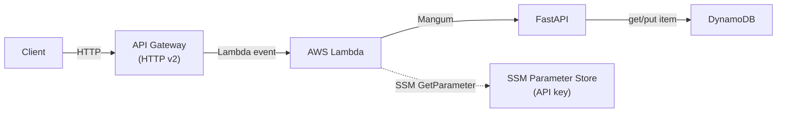

# Cache Service

A serverless HTTP caching service built with **FastAPI**, deployed on **AWS Lambda** behind **API Gateway**, and backed by **DynamoDB** with TTL-based auto-expiry.

---

## Architecture



The application follows a clean **layered architecture**:

| Layer | File | Responsibility |
|---|---|---|
| Routes / Handler | `app/api_handler.py` | API endpoints, exception handlers, Mangum adapter |
| Middleware | `app/middlewares.py` | API key validation, correlation ID propagation |
| Schemas | `app/schemas.py` | Request validation (Pydantic) |
| Service | `app/services.py` | Business logic, TTL conversion, data mapping |
| Repository | `app/repositories.py` | DynamoDB data access layer |
| Settings | `app/settings.py` | Environment config via `pydantic-settings`, SSM integration |
| Exceptions | `app/exceptions.py` | Custom HTTP exceptions |

Key components:

- **FastAPI** — ASGI framework with automatic OpenAPI docs and validation
- **Mangum** — Adapts FastAPI for AWS Lambda + API Gateway
- **DynamoDB** — Key-value storage with TTL-based auto-expiry (on-demand billing)
- **SSM Parameter Store** — Encrypted API key storage
- **Powertools** — Structured logging and observability
- **OpenTofu** — Infrastructure as Code (Terraform-compatible)

---

## API

All `/api/cache/*` endpoints are guarded by an **API key middleware**. Requests must include an `X-Api-Key` header matching the key stored in **SSM Parameter Store** (fetched at cold start and cached for the Lambda instance lifetime). Unauthenticated requests receive a `401 Unauthorized` response.

The `GET /health` endpoint is unauthenticated by design.

### `GET /api/cache/{key}`

Retrieve a cached value by key.

**Headers:** `X-Api-Key: <your-api-key>`

**Response `200`:**
```json
{
  "key": "my-key",
  "value": "some-value",
  "createdAt": "2026-06-11T14:00:00+00:00",
  "ttl": 3600,
  "expiredAt": "2026-06-11T15:00:00+00:00"
}
```

**Response `404`:**
```json
{
  "status": 404,
  "id": "0195c5a2-6dfb-7458-80c1-5af38e78c51e",
  "message": "Key was not found: my-key"
}
```

### `POST /api/cache`

Create or update a cached entry.

**Headers:** `X-Api-Key: <your-api-key>`

**Request body:**
```json
{
  "key": "my-key",
  "value": "any JSON value",
  "ttl": 3600
}
```

- `key` — required, string identifier
- `value` — required, any JSON-compatible value
- `ttl` — optional, time-to-live in seconds from now (`0` = no expiry)

**Response `201`:** Returns the created entry (same shape as GET response).

### `GET /health`

Unauthenticated health check.

```json
{ "status": "healthy" }
```

### Error format

All error responses follow a consistent shape:

```json
{
  "status": 4xx,
  "id": "0195c5a2-6dfb-7458-80c1-5af38e78c51e",
  "message": "Human-readable error description"
}
```

Every response includes an `X-Correlation-ID` header for request tracing.

---

## Getting Started

### Prerequisites

- Python 3.14+
- [uv](https://docs.astral.sh/uv/) package manager
- Docker (for Lambda builds)
- AWS credentials (for deployment)

### Local development

```bash
# Install dependencies (including dev)
uv sync --group dev

# Set up environment
cp .env.example .env

# Run the server
uv run uvicorn app.api_handler:app --reload --port 3000
```

Open [http://localhost:3000/docs](http://localhost:3000/docs) for the interactive Swagger UI.

### Testing

```bash
# Full test suite
make test

# With verbose output and coverage
uv run pytest -v --cov=app --cov-report=term-missing

# Run unit tests only
uv run pytest tests/unit

# Run integration tests only
uv run pytest tests/integration
```

Tests use [moto](https://github.com/getmoto/moto) to mock AWS services (DynamoDB, SSM) — no real AWS account needed.

### Linting & formatting

```bash
# Lint check
make lint

# Auto-format
make format

# Security scan
make bandit
```

Or directly with `uv run ruff check .` / `uv run ruff format .` / `uv run bandit -c pyproject.toml -r app`.

---

## Project structure

```
.
├── app/
│   ├── __init__.py           # App factory
│   ├── api_handler.py        # FastAPI app, routes, Mangum wrapper
│   ├── schemas.py            # Pydantic request schemas
│   ├── services.py           # Business logic layer
│   ├── repositories.py       # DynamoDB data access
│   ├── dependencies.py       # FastAPI dependency injection
│   ├── exceptions.py         # Custom HTTP exceptions
│   ├── middlewares.py        # API key & correlation ID middleware
│   └── settings.py           # pydantic-settings configuration
├── tests/
│   ├── conftest.py           # Global fixtures (moto mock_aws)
│   ├── unit/
│   │   ├── conftest.py
│   │   ├── repository/
│   │   │   └── test_cache_repository.py
│   │   └── service/
│   │       └── test_cache_service.py
│   └── integration/
│       └── test_cache_api.py
├── infrastructure/           # OpenTofu / Terraform IaC
│   ├── main.tf
│   ├── variables.tf
│   ├── locals.tf
│   ├── dynamodb.tf
│   ├── lambda.tf
│   ├── layer.tf
│   ├── api_gateway.tf
│   ├── iam.tf
│   └── ssm.tf
├── scripts/                  # Build & deployment scripts
│   ├── build_api.sh
│   ├── build_requirements_layer.sh
│   ├── upload_api.sh
│   └── upload_requirements_layer.sh
├── .github/workflows/
│   └── ci.yml                # CI pipeline
├── Makefile
├── Dockerfile
├── pyproject.toml
├── ruff.toml
├── .python-version
└── .env.example
```

---

## Configuration

Environment variables (see `.env.example`):

| Variable | Description | Default |
|---|---|---|
| `APP_NAME` | Application identifier | `cache-service` |
| `STAGE` | Deployment stage (local, dev, test) | `local` |
| `DEBUG` | Enable debug mode | `true` |
| `DEFAULT_TIMEZONE` | Timezone for timestamps | `UTC` |
| `LOG_LEVEL` | Logging level | `INFO` |
| `CACHE_SERVICE_API_KEY_SSM_PARAM_NAME` | SSM parameter path for the API key | `/dev/service/api-key` |
| `AWS_DEFAULT_REGION` | AWS region | `eu-central-1` |

---

## Deployment

### Build Lambda artifacts

```bash
# Build the API deployment package (app/)
make build-api

# Build the Lambda layer with dependencies
make build-layer

# Build both
make build-lambda
```

Build scripts use Docker (Amazon Linux 2) for reproducible, Lambda-compatible artifacts.

### Infrastructure

Deploy with OpenTofu:

```bash
cd infrastructure
tofu init
tofu plan
tofu apply
```

Terraform is also supported (`terraform` instead of `tofu`).

### CI pipeline

The CI workflow (`.github/workflows/ci.yml`) runs automatically on every branch and pull request:

1. **Security scan** — Bandit against the `app/` package
2. **Lint & format** — Ruff check and format verification
3. **Tests** — pytest with coverage (unit + integration, including mocked AWS services)
4. **Coverage** — Upload to Codecov
5. **Quality** — SonarQube scan

---

## Key design decisions

- **DynamoDB single-table design** — `key` (string) as the hash key, `ttl` attribute for DynamoDB-native TTL auto-expiry. `PAY_PER_REQUEST` billing.
- **Consistent reads** — `get_item` uses `ConsistentRead=True` for strong read-after-write consistency.
- **API key caching** — Loaded from SSM Parameter Store at cold start via `cached_property` to avoid per-request SSM calls.
- **TTL handling** — The `POST` endpoint accepts `ttl` in seconds from "now"; the service layer converts to a Unix timestamp for DynamoDB. Passing `ttl=0` means no expiry (stored as `None`).
- **Correlation IDs** — Every response includes `X-Correlation-ID` (from request header, AWS request ID, or a generated UUID), enabling end-to-end tracing.
- **Error responses** — Uniform JSON error body with a unique UUID per error for traceability.
- **Layered architecture** — Clear separation between routes, middleware, business logic, and data access, making the service testable at each layer independently.
